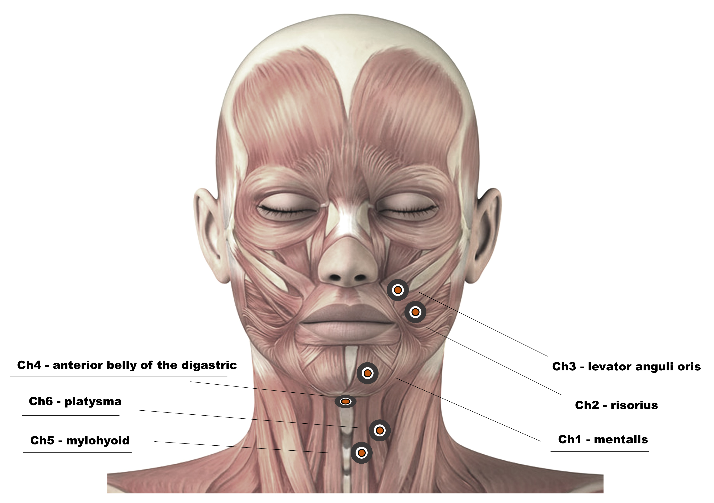

# A Benchmark Dataset for Electromyography-based Silent Speech Recognition 

This repository contains dataset employed in ***A Simplified Adversarial Architecture for Cross-Subject Silent Speech Recognition Using Electromyography***.
The details and original provenance of the dataset come from another paper by our team, entitled ***A Benchmark Dataset for Audio-Visual-Electromyography-based Multi-modal Speech Recognition***.

## Dataset Description

### Data Acquisition 

A surface Electromyography (sEMG) acquisition system is constructed, through which a 6-channel sEMG signal is obtained by deploying six pairs of acquisition electrodes and a reference electrode on one side of the face and neck area. 

These signals are acquired to demonstrate the physiological activities of six muscles, including mentalis, risorius, levator labii superioris, anterior belly of the digastric, mylohyoid, and platysma.

### Corpus

The corpus is mainly designed for elderly and disability assistance scenarios in the light of Maslow's hierarchy of needs, covering 5 kinds of basic needs in daily life. 
- It is a collection of 100 short sentences in Chinese Mandarin together with an empty one containing no articulation movement as a reference for active muscle activity. 
- Each sentence consists of 3 to 5 Chinese characters. 

The corpus will be released synchronously when the dataset paper is officially published.

### Data Size

The dataset contains 99,688 utterances from 100 speakers in 101 categories, lasting more than 55 hours.

## Pre-released Data

We have released the sEMG silent speech dataset in our experiments [here](https://pan.baidu.com/s/1WyQVJOZyb6woQ70BLSRinQ). This dataset is for study and research use only, and any other commercial use is strictly prohibited. 

If you need to use it, please contact us to obtain the data extraction code after providing the necessary information. 

An official citation will be updated here subsequently.

## Relevant Paper on the Dataset

Another work by our team entitled **A Benchmark Dataset for Audio-Visual-Electromyography-based Multi-modal Speech Recognition** is undergoing peer review. The non-peer-reviewed version is released [here](https://github.com/HaloFame/EMG100/raw/main/dataset_paper_nonereviewed.pdf) first, and citation and access will be updated once the paper is accepted.
